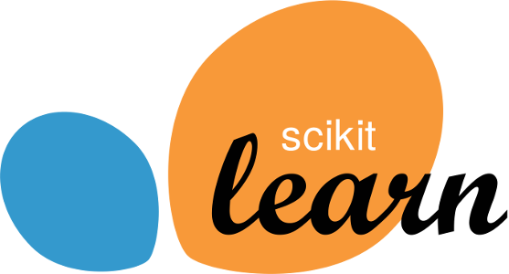

<h1 align="center"> Sklearn analytics </h1>

  

 
 
<h2 align="center">🏁 El proyecto se encuentra terminado 🏁 </h2>

<h4> 🔨 En la universidad tomé una clase llamada "fundamentos de analitica" donde aprendimos a utilizar diversos modelos de machine learning por medio de la libreria Scikit-Learn en Python los cuales están plasmados en este repositorio 🔨 </h4>

 
## 📁 Acceso al proyecto

**Este proyecto puede ser descargado como archivo ZIP o realizando una conexión con el http por medio de git**

 
## 🛠️ Abre y ejecuta el proyecto

**Se puede correr el archivo desde la terminal en cualquier sistema operativo**
 
## ✅ Tecnologias usadas

- **Python** 
- **Scikit-learn** 
- **Numpy** 
- **Pandas** 
 

## Estos son los proyectos realizados en este repositorio

`Analisis de sentimientos`:

 Este script se encarga de tomar una cantidad de comentarios realizados a la empresa Amazon, a partir de la información del archivo el script define si es un comentario indeterminado, positivo o negativo. Se utilizan funciones para la carga de datos, la limpieza de datos, el analizador de palabras y la creacion del Pipeline para el entrenamiento, luego se realiza la evaluación del modelo y pronostica los datos 

`Regresion lineal univariada`;

 Realizamos un script encargado de realizar una regresion univariada en la que se predice la probabilidad de fertilidad de una poblacion con base a su con la variable independiente de la edad de la persona. Para este modelo las funciones utilizadas se encargan primero de cargar y limpiar los datos necesarios, luego validamos la informacion estadistica de los datos obtenidos, luego se entrena el modelo con toda la base de datos (para realizar pruebas), posteriormente se realiza la particion correspondiente y volvemos a entrenar el modelo para luego realizar la prediccion correcta 

`Regresion lineal multivariada`:

  En este modelo usamos n variables para realiar las validaciones del modelo con una prueba f, tenemos tanto variables numericas como categoricas  para predecir los cargos del seguro de una persona con base a la información de la misma. En este modelo se cargan y limpian los datos, luego creamos el Pipeline que transformara las variables categoricas usando OneHotEncoder para que puedan ser tenidas en cuenta en el modelo, luego selecciona la mejor cantidad de variables y por ultimo entrena el modelo. Luego sobre esta funcion pasamos los datos particionados y con el metodo GridSearchCV obtenemos la mejor ombinacion de variables para el modelo  

`Regresion logistica`

 Este modelo se encarga de identificar si un hongo es venenoso o no con una muestra de datos teniendo en cuenta si hay riesgo de que sean venenosos o no. Primero el modelo carga y limpia los datos con una preparacion del dataset, luego creamos el modelo con el Pipeline donde codificando las variables categoricas para que sean tenidas en cuenta y por ultimo evaluamos el modelo 

